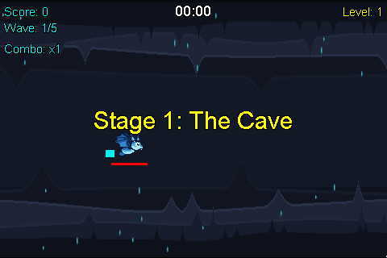

# CyanBat

CyanBat is a side-scrolling 2D action game, inspired by retro classics like *Gradius* and modern
arcade staples like *Flappy Bird*. It runs on **Android** and on the **desktop** (Windows, macOS
and Linux) from a single shared codebase.

<p align="center">
  
</p>
<p align="center">
  <sub><b>The Cave</b> from start to boss, then glimpses of <b>The Forest</b> and <b>The Desert</b>, from real runs of the game; see <a href="#-gameplay-footage">how it is recorded</a>.</sub>
</p>

## 🚀 Architecture

- **Kotlin Multiplatform**: the engine and the whole game — rules, screens and menu UI — are
  common code. The platform modules only supply platform pieces: a framebuffer, input, audio,
  haptics and persistence.
- **Compose Multiplatform**: one set of menu, settings and credits screens renders on both
  Android and desktop, from shared string and drawable resources.
- **Entity Component System**: `:engine`'s ECS decouples game logic from data, so behavior is
  composed from components rather than an inheritance hierarchy.
- **Value class optimization**: `Vector2` is a bit-packed value class, so movement math
  allocates nothing in the game loop.
- **Sub-pixel precision**: geometry is float-based, and the frame loop clamps its delta so a
  resume cannot fast-forward the simulation.
- **Adaptive music**: each stage's music is eight stems mixed live, in the manner of Doom 2016
  and SSX 3. The waves raise a floor and the combo's fire builds on it, every rung it climbs from
  HOT to SUPERNOVA bringing more of the piece in on the beat: past the tune, a trap beat grows
  under the stage's own instruments - 808s, then rolling hi-hats, then chopped voices - and a
  streak gone SUPERNOVA brings in the boss's own layer as well. A hit knocks the music back with a
  thud, the level-up dialog holds it under a muffle, and the boss arrives on a drop to silence and
  a slam back in on the downbeat. The stems are IMA ADPCM, decoded by the shared engine, so they
  line up to the sample on every platform.

## 📁 Project structure

| Module | What it is |
| --- | --- |
| `:engine` | Platform-agnostic engine: `Game`/`Screen`/`Graphics`/`Audio` interfaces, the ECS (`at.smiech.engine.ecs`), math (`at.smiech.engine.math`), and the shared `GameLoop`. `androidMain` and `jvmMain` hold the platform implementations. |
| `:game` | CyanBat itself: game screens, entity factory, spawners, and the shared Compose UI. Android + JVM, and iOS too, though no iOS app exists yet. |
| `:app` | Android application — activities, DataStore, and Android asset wiring. |
| `:desktop` | Compose Desktop application — window, JVM asset wiring, and preferences-backed storage. |

Game assets live once at the repo root in `assets/`, packaged as Android assets by `:app` and as
classpath resources by `:desktop`.

## ▶️ Running it

Desktop, no emulator needed:

```bash
./gradlew :desktop:run
```

Android:

```bash
./gradlew :app:installDebug
```

There is also a `/run-cyanbat` skill that drives the Android build end to end on an emulator —
build, install, launch, screenshot, and check persistence. See
[.claude/skills/run-cyanbat/SKILL.md](.claude/skills/run-cyanbat/SKILL.md).

## 🗺 Stages

| Stage | What it throws at you |
|---|---|
| 1. The Cave | Five one-minute waves of imps, then a boss that weaves and fires back. |
| 2. The Forest | Wasp swarms, wisp formations, diving owls, hovering spitters that aim at you, and beetles behind shield bubbles - tougher and faster than the cave, ending in the three-phase Moth Queen. |
| 3. The Desert | Flown from noon into nightfall: the sun sets as the waves go by and the stars come out for the boss. Locust clouds, looping hawks, djinn throwing fans of fire, scarabs whose shells grow back, and wyrmlings that cruise in under the sand and leap at you - ending in the Sand Wyrm, which breaches out of the dunes in arcs and can be hit anywhere along its body. |

Beating a stage unlocks the next, and from then on Start Game opens a stage select. Every stage is
flown from a standing start: score, experience and power-ups reset when it begins. Each stage keeps
its own highscore, shown on its card in the stage select and at the end of every run. The art and
the music for all of them are generated by the scripts in `tools/`; the desert's sky is drawn by
the game itself, from the stage clock. Each stage has a score of its own - a campfire guitar in the
cave, wooden drums and a bamboo flute in the forest, an oud and a ney in the desert - that starts
out quiet and builds as the fight does. The menu has a theme of its own, a dark synth loop with a
heartbeat under it, and a lost run gets a lament.

Everything that can be hurt shows it. The bat and every hostile are drawn three ways - unhurt,
wounded once a third of their health is gone and battered once two thirds are - with torn wings,
cracked shells, snapped horns and narrowed eyes, and a boss looks as far through its fight as its
phases say it is.

## 🎮 Controls

|            | Move                                   | Pause / resume  | Quit to menu |
|------------|----------------------------------------|-----------------|--------------|
| Touch      | Drag the bat, or tap where you want it | — (tap resumes) | Back, twice  |
| Keyboard   | `WASD` or the arrow keys               | `Q`             | `Q`, twice   |
| Controller | Left stick or d-pad                    | `Start`         | `B`          |

Dragging pins the bat under your finger and keeps the offset you grabbed it by, so it never snaps
out from under the fingertip; the hit box is padded well past the sprite so it is catchable
without aiming. A touch landing away from the bat flies it over instead, which is how the game
played before it was draggable. Holding a key or pushing a stick overrides a drag for as long as
it lasts.

Backgrounding the app — or, on desktop, the window losing focus — pauses the run, and it stays
paused until you resume it rather than dropping you straight back into a dodge.

Controller support is real on Android, where the platform reports pads as key codes and joystick
axes. On desktop the JDK has no gamepad API, so nothing feeds those events yet: the mapping seam
is `ControlHandler.onAxis`/`onButton`, and a backend only has to call them.

## 🧪 Building and testing

```bash
./gradlew build
```

Assembles every module, runs lint, and runs the unit tests — ECS, math, spawn pacing, the music
mixer's timing, a check that every stage's music stems fit the grid the game plays them on, and
one that the MP3 service provider the desktop's death sound depends on is actually present.

`:engine` and `:game` also have iOS targets, groundwork for an iOS app that does not exist yet, so
shared code cannot quietly come to depend on the JVM. Only a Mac builds them: there `build` also
compiles the shared code for iOS and runs its tests on the simulator, as CI's `ios` job does.
Elsewhere they are skipped, which spares Linux and Windows builds the Kotlin/Native toolchain.

## 🎬 Gameplay footage

The GIF at the top of this page is recorded rather than staged:

```bash
./gradlew :desktop:recordGameplay
```

This flies each stage on an autopilot — a virtual game pad that reads the run's world and dodges
whatever is coming — through the desktop build's own renderer, headless and faster than real time.
Each run is then cut down to a few short clips, and the stages are strung together into one reel,
`docs/gameplay.gif`. Each stage gives away less than the one before, so the footage leaves the
later stages to be discovered: the cave from its title through a level up and its busiest wave to
the boss going down; the forest in glimpses, up to the moment its boss arrives; the desert in fewer
still, and never its boss. Every recording is a different run, because the game rolls its spawns
fresh each time, and a run the autopilot loses is flown again. Re-record after changing anything
that shows on screen. `--args="--stages=3 --out=build/desert.gif --frames=build/frames"` records
just the desert's part, away from the README's copy, and also writes its frames out as PNGs to look
through.

## 📦 Cutting a release

Every artifact takes its version from `cyanbat.version` in `gradle.properties`. The release
workflow overrides it with the tag being built, so tagging is what sets the version — the property
is only what an untagged build stamps.

Pushing a version tag builds and publishes everything:

```bash
git tag 2.0 && git push origin 2.0
```

That produces a signed Android APK plus Windows, macOS and Linux desktop installers, and attaches
them to a GitHub release. Tags work with or without a leading `v`; a suffixed tag such as `2.1-rc1`
publishes as a pre-release. To rehearse without spending a tag, run the **Release** workflow
manually from the Actions tab — it builds and uploads the same artifacts to the run, and publishes
nothing.

### Signing secrets

The APK is signed with a keystore supplied through repository secrets, so nothing sensitive lives
in the repository.

2.0 is signed with a **new** keystore. The one the 1.x releases used is gone, and Android identifies
an app by its signature, so 2.0 is a fresh install rather than an update — anything still running a
1.x build has to be uninstalled first. That break is a one-off; from 2.0 onwards the same keystore
has to keep being used, because losing it again would force the same break on whoever is running
2.x by then.

Create it once, and back it up somewhere you will still have in a few years:

```bash
keytool -genkeypair -v -keystore cyanbat-release.jks -storetype PKCS12 \
  -alias cyanbat -keyalg RSA -keysize 4096 -validity 10000
```

Then add four repository secrets, under **Settings → Secrets and variables → Actions**:

| Secret | What it is |
|---|---|
| `ANDROID_KEYSTORE_BASE64` | The keystore file, base64-encoded |
| `ANDROID_KEYSTORE_PASSWORD` | Keystore password |
| `ANDROID_KEY_ALIAS` | Alias of the signing key inside the keystore — `cyanbat` above |
| `ANDROID_KEY_PASSWORD` | Password for the key. **Optional on PKCS12**, see below |

A PKCS12 keystore has only one password. `keytool` refuses to give the key its own — *"Different
store and key passwords not supported for PKCS12 KeyStores"* — and the store password is what
unlocks the key. So a keystore whose key appears to have no password is normal, not broken: leave
`ANDROID_KEY_PASSWORD` unset and the build uses the store password. Set it only for an older JKS
keystore that genuinely carries a separate one.

Encode the keystore with:

```bash
base64 -w0 cyanbat-release.jks
```

Without these the release job fails rather than publishing an APK nobody can install. Local builds
and pull requests need no keystore at all — `assembleRelease` simply produces an unsigned APK, as
it always has.

Desktop installers are unsigned, so Windows SmartScreen and macOS Gatekeeper will warn on first
run. Fixing that needs a paid code-signing certificate and an Apple developer account.

## 🛠 Tech stack

- **Language**: Kotlin 2.x, Kotlin Multiplatform
- **UI**: Compose Multiplatform
- **Persistence**: Jetpack DataStore (Android), `java.util.prefs` (desktop)
- **Audio**: a shared stem mixer for all of the music, played through `AudioTrack` on Android and
  a `javax.sound.sampled` line on the desktop; the mp3spi/jlayer service providers decode the
  desktop's MP3 death sound
- **CI/CD**: GitHub Actions

## 📜 History

This project originated as an academic project in 2012, based on the principles from *Beginning
Android Games* by Mario Zechner and Robert Green. The original framework was provided by DI Robert
Grüneis. In 2026 it was refactored from legacy OOP to a data-driven ECS architecture, and then
from an Android-only app to Kotlin Multiplatform with a desktop target.

---
*Developed with ❤️ using Kotlin.*
